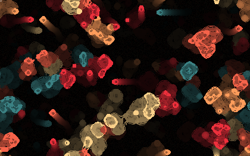

# HighLife  

  

## Dependencies
 * GLFW3 (`sudo apt-get install libglfw3-dev` on Debian based distribution)
 * OpenGL (`sudo apt-get install libgl1-mesa-dev libglu1-mesa-dev` on Debian based distribution)

## Building & Run

*With CMake installed*
1. `$ cmake .`
2. `$ make`
3. `$ ./build/life`

## Help  
Command-line options `./life -h`  
Controls `./life -hc`  

## License
his project is licensed under the terms of the [BALEC license](LICENSE).

## TODO  

### features  
 * Real cell values -> support multi values in algorithm
 * touchscreen support
 * improve palettes format: variable number of colors

### Optimizations  
 * linked-list init of cell struct for neighbors
 * render to texture from cpu
 * threading
 * alpha masking instead of redrawing
 * min. OpenGL 3 api support
